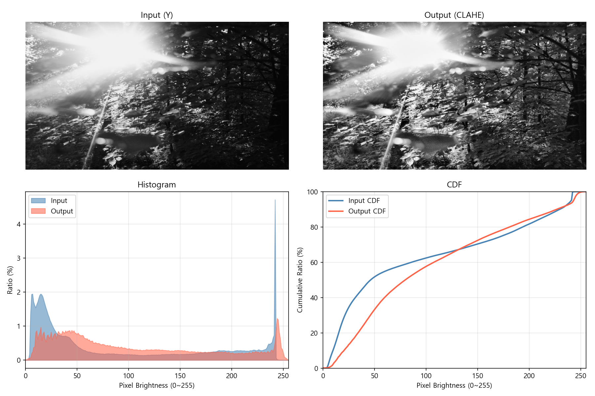
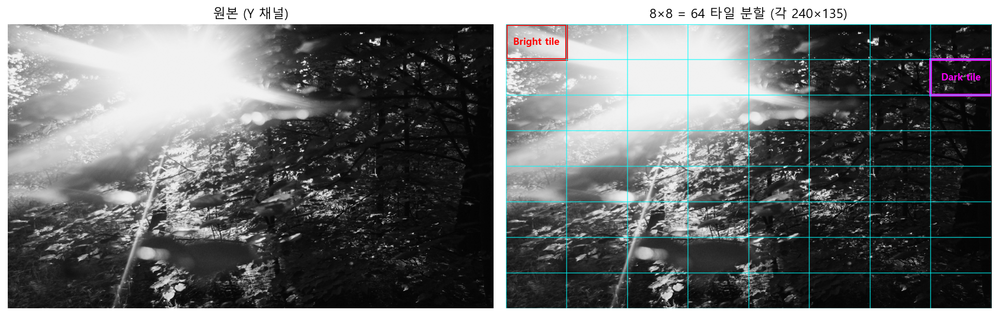
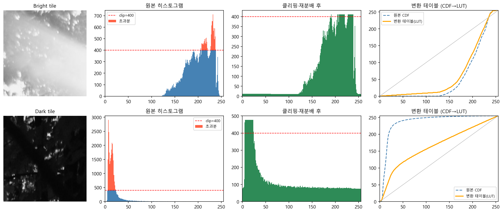
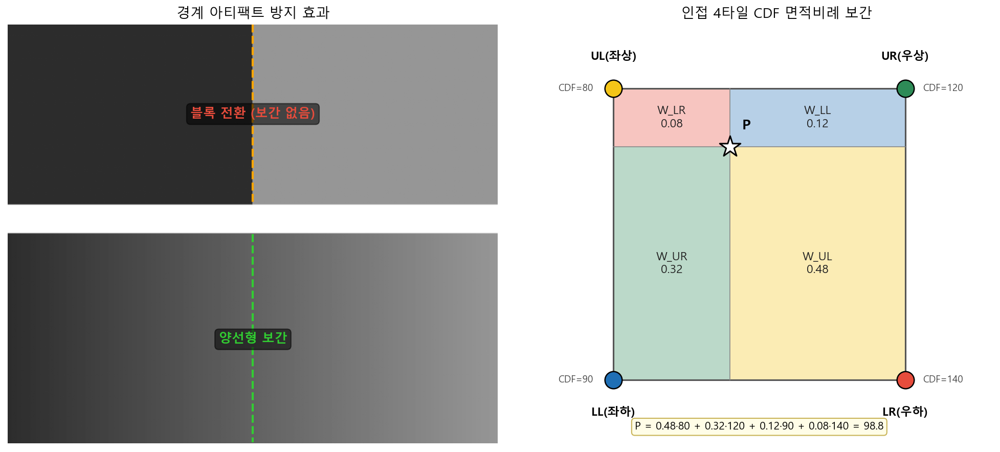
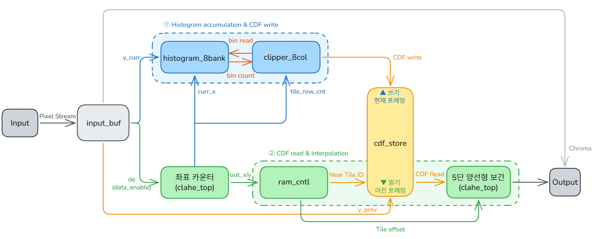

# CLAHE Hardware Accelerator (Zynq-7000 FPGA)

Zynq-7000 (XC7Z020) FPGA에서 FHD 1080p 60fps 실시간 CLAHE(Contrast Limited Adaptive Histogram Equalization)를 구현한 RTL 설계 프로젝트.

- **입력**: YCbCr 4:2:2 AXI-Stream (DE 신호 기반)
- **출력**: 명암 보정된 YCbCr 4:2:2 AXI-Stream
- **처리량**: 1클럭 2픽셀, 100MHz → 유효픽셀 처리량 기준 38% 여유 (FHD 60fps 최소 62.2MHz)
- **레이턴시**: 보간 6클럭 + 1프레임 지연(직전 프레임 CDF 적용)
- **범위**: RTL 설계 + STA 검증 (비트스트림·실보드는 범위 외)

---

## Results

### Timing (100MHz STA) — Failing Endpoint 0

| Condition    | Worst Slack |
|--------------|-------------|
| Setup (WNS)  | +0.886 ns   |
| Hold (WHS)   | +0.011 ns   |
| Pulse Width  | +3.750 ns   |

### Resource (XC7Z020) — 전 항목 50% 미만, 0.363W

| Resource | Used   | Util % |
|----------|-------:|-------:|
| LUT      | 10,894 | 20.48  |
| LUTRAM   |  8,448 | 48.55  |
| FF       |    685 |  0.64  |
| BRAM     |     64 | 45.71  |
| DSP      |     14 |  6.36  |

### Image Quality (vs floating-point reference)



| Metric     | Value   |
|------------|---------|
| PSNR       | 46.65 dB |
| SSIM       | 0.998   |
| MAE        | 1.03 LSB |
| Error ≤2LSB | 99.86 % |
| Entropy    | 7.28 → 7.77 bit (+0.48) |

---

## Algorithm

CLAHE는 3단계로 동작한다.

1. **Tile Histogram** — 영상을 8×8 타일(240×135 px)로 분할, 타일별 휘도 히스토그램 독립 누적



2. **Clip & CDF** — `clip_limit` 초과분 균등 재분배 → CDF 누적 → 0~255 정규화 (변환 테이블)



3. **Bilinear Interpolation** — 인접 4타일 CDF를 위치 면적비로 혼합해 타일 경계 아티팩트 제거



---

## Architecture



**Frame-Delay + Ping-Pong**: 2-pass 의존성 해결. 현재 프레임 히스토그램 누적 ↔ 직전 프레임 CDF 적용을 Ping-Pong 페이지로 병행.

---

## Key Design Decisions

### 1클럭 2픽셀
YCbCr 4:2:2 포맷에서 32비트 워드 `{Y0, Cb, Y1, Cr}`에 휘도 2픽셀이 함께 들어온다. 이를 활용해 유효픽셀 기준 62.2MHz면 FHD 60fps 수용 가능 → 100MHz로 여유 확보. 무작정 클럭을 올리는 대신 데이터 포맷에서 병렬성을 찾는 것이 핵심이었다.

### BRAM ×8 복제
양선형 보간은 1클럭에 4방향 타일 × Y0/Y1 = **8개 CDF 동시 읽기** 필요. BRAM은 최대 2-Port이므로 동일 데이터를 8개 BRAM에 복제해 독립 읽기 포트로 사용. 쓰기는 8개 동시 → 추가 사이클 없음. BRAM 45.71% 사용의 원인.

### Hazard Forwarding (histogram)
LUTRAM Read-Modify-Write는 1클럭 소요. 연속된 두 픽셀이 같은 주소를 접근하면 구값을 읽어 카운트 누락. 직전 주소와 동일할 때 `next_count`를 직접 전달해 해결:

```verilog
wire hazard_y0 = de_d1 && (addr_y0 == addr_y0_d1);
wire [15:0] eff_y0 = hazard_y0 ? next_count_y0 : rd_y0;
```

### DE 게이팅 (VALID 미사용)
블랭킹 구간에 `s_axis_valid=1`이 들어오면 무효 픽셀이 히스토그램에 누적된다. `valid` 대신 **`de_in`(Data Enable)** 으로 히스토그램 게이팅.

### 곱-시프트 근사 (나눗셈 제거)
상수 나눗셈(÷32400, ÷240, ÷135)을 곱셈·비트시프트로 대체해 타이밍 경로 단축. CDF 정규화 ÷32400은 `×516>>16`, x/y 가중치 ÷240·÷135는 각각 `×273>>8`·`×243>>7`로 근사 (상대오차 0.1% 미만):

```verilog
// ÷ 32400  →  × 516 >> 16  (516/65536 ≈ 255/32400, 오차 0.04%)
wire [31:0] norm_calc = ({8'b0, cdf_next_ff} * 32'd516) >> 16;
```

### 5단 양선형 보간 파이프라인
보간 4방향 곱셈·합산이 1클럭에 집중 → WNS 음수. 5단계로 분리:
오프셋 → 가중치 → 4방향 가중치 → 부분곱·합산 → 출력. 처리량 1클럭 2픽셀 유지.

---

## Files

```
rtl/
├── clahe_top.v         — 최상위 모듈, 좌표 카운터, 5단 보간 파이프라인
├── input_buf.v         — YCbCr 4:2:2 분리, Y 1클럭 지연
├── histogram_8bank.v   — 8뱅크 LUTRAM 히스토그램 + Hazard Forwarding
├── clipper_8col.v      — 클립·재분배·CDF 정규화
├── cdf_store.v         — BRAM ×8 Ping-Pong CDF 저장
├── ram_cntl.v          — 타일 ID, 오프셋 계산
├── clahe_top.xdc       — 100MHz 타이밍 제약
└── tb_clahe_top.v      — 테스트벤치
```

---

## Build

- **Tool**: Vivado 2023.x (WebPACK)
- **Target**: xc7z020clg400-1 (Zynq-7000)
- **Top module**: `clahe_top`
- **Constraint**: `clahe_top.xdc` (100MHz 클럭)

---

## Limitations

- STA 전용 — 실보드 동작 미검증
- 타일 크기(8×8)·해상도(1080p)가 하드코딩에 가까워 변경 시 모듈 수정 필요
- BRAM 45.71% — 8포트 보간을 위한 8복제 구조. 활성 타일 행만 버퍼링하는 working-set 방식으로 절감 가능 (미구현)

---

## References

1. T. Kryjak et al., "Real-Time CLAHE Algorithm Implementation in SoC FPGA Device for 4K UHD Video Stream," *Electronics*, vol. 11, no. 14, Art. 2248, 2022.
2. K. Zuiderveld, "Contrast Limited Adaptive Histogram Equalization," in *Graphics Gems IV*, Academic Press, 1994, pp. 474–485.
3. AMD/Xilinx, *Zynq-7000 SoC Technical Reference Manual*, UG585, 2023.
4. ARM, *AMBA 4 AXI4-Stream Protocol Specification*, IHI 0051A, 2010.
